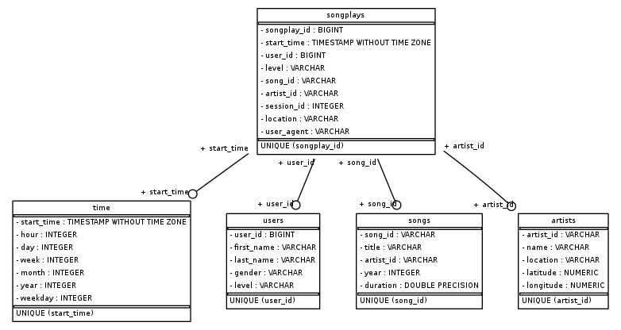

# Sparkify's DATA MODELING WITH POSTGRES  *V 1*

The aim of this project is to provide a **Postgres Database** and an **ETL pipeline** offering to the analytics team an easy way to analyse the user activity on the new **music streaming app**.

>The **ETL pipeline** extracts data from **JSON** files containing users logs and songs metadata then loads them to the **Database** after a data transformation to a format that will be more meaningful for data analysis

### Technologies/Tools

Following are different technologies used in this project :

* [POSTGRESQL](https://www.postgresql.org/) - Great open source RDBMS
* [Python 3](https://www.python.org/) - Awesome programming language, easy to learn and with awesome data science libraries and communities
* [Pandas](https://pandas.pydata.org/) - Python Library for data manipulation and analysis
* [psycopg2](https://www.psycopg.org/) - Popular PostgreSQL database adapter for the Python programming language
*  [Jupyter](https://jupyter.org/) - Project Jupyter is a nonprofit organization created to "develop open-source software, open-standards, and services for interactive computing across dozens of programming languages". *(This project is developed using Jupyter environment as the IDE(Code Editor) but it can also work well with any other code editor such as VS Code, ..)*

### Usage
This app requires the technologies mentioned above to run.

```sh
$ #cd to the project home directory/folder
$ python3 create_tables.py
$ python3 etl.py
```

### Directory(Folder) Structure

| File/Folder | Description |
| ------ | ------ |
| data/log_data/ | This directory consists of log files in **JSON** format generated by this event simulator based on the songs in the dataset above. These simulate activity logs from a music streaming app based on specified configurations |
| data/song_data/ | Each file under this directory is in **JSON** format and contains metadata about a song and the artist of that song. The files are partitioned by the first three letters of each song's track ID. For example, here are filepaths to two files in this dataset. |
| sql_queries.py | Here Different **SQL queries** (Table Creation/Destroy, INSERT and SELECT) are written and store in python variables |
| create_tables.py | A module we use to create and drop our database and also our tables |
| etl.py | A module containing all our **ETL** functions |
| etl.ipynb | A jupyter notebook helping to exercice on **ETL** and preprare for the etl.py module   |
| test.ipynb | A jupyter notebook helping to that every database table has been Inserted with data   |
| sparkifydb_erd.png | ER Diagram   |
| README.md | Information about the project    |


### Database Schema

##### Dimension Tables
-  **users**

| Column | Datatype | Constrainct | Description |
| ------ | ------ |------ | ------ |
| user_id | BIGINT |PRIMARY KEY | This is a unique key representing each user and we opted for an BIGINT type because we are able to extract as a non decimal number format from the log file and as the number of user grows, BIGINT will be the right  Datatype|
| first_name | varchar |NOT NULL |  |
| last_name | varchar |NOT NULL |  |
| gender | varchar | |  |
| level | varchar |NOT NULL |  |

-  **songs**

| Column | Datatype | Constrainct | Description |
| ------ | ------ |------ | ------ |
| song_id | varchar |PRIMARY KEY | This is a unique key representing each song and we opted for a varchar type because we are receiving the song ID as a string of different alphabetic characters from the song metadata |
| title | varchar |NOT NULL |  |
| artist_id | varchar | NOT NULL | it's in varchar because the artist ID from the song metadata files are also strings of different alphabetic characters|
| year | int | |  |
| duration | float | |  |

-  **artists**

| Column | Datatype | Constrainct | Description |
| ------ | ------ |------ | ------ |
| artist_id | varchar |PRIMARY KEY | This is a unique key representing each artist and we opted for a varchar type because we are receiving the artist ID as a string of different alphabetic characters from the song metadata |
| name | varchar |NOT NULL |  |
| location | varchar | | |
| latitude | decimal | |  |
| longitude | decimal | |  |

-  **time**

| Column | Datatype | Constrainct | Description |
| ------ | ------ |------ | ------ |
| start_time | timestamp |PRIMARY KEY | This is a  key representing each recorded time in postgres timestamp format wich is YYYY-MM-DD hh:mm:ss... This is a PRIMARY KEY key because there will be no need to store a different record with the same timestamp |
| hour | int |NOT NULL |  |
| day | int |NOT NULL | |
| week | int |NOT NULL |  |
| month | int |NOT NULL |  |
| year | int |NOT NULL |  |
| weekday | int |NOT NULL |  |

##### Fact Tables
-  **songplays**

| Column | Datatype | Constrainct | Description |
| ------ | ------ |------ | ------ |
| songplay_id | BIGSERIAL |PRIMARY KEY | This is an auto increament key representing each recorded songplay, BIGSERIAL type helps us to care less about the quantity of songplay records we will store as the platform grows  |
| start_time | timestamp |FOREIGN KEY time.start_time | This is a  key representing each songplay time in postgres timestamp format wich is YYYY-MM-DD hh:mm:ss... |
| user_id | BIGINT |NOT NULL, FOREIGN KEY users.user_id |  |
| level | varchar | | |
| song_id | varchar |FOREIGN KEY songs.song_id | the song id stored in artists table is of varchar data type |
| artist_id | varchar |FOREIGN KEY artists.artist_id| the artist id stored in artists table is of varchar data type |
| session_id | int | |  |
| location | varchar | |  |
| user_agent | varchar | |  |

### ETL pipeline
The ELT processes are operated as follow:
-   Read JSON file Pandas **read_json** methond
-   Extract and transform if needed data related to a specific table
-   Loop through the extracted data and load to the db using **psycopg2** with writen SQL insert queries

##### Process Song Files

Song files consist of files under `data/song_data/` directory
The **Dataframe** containing the extracted **JSON** is assigned to the variable `df`
-  **songs**
>Data related to songs are extracted from the `df` dataframe as follow:
>`song_data = df[['song_id', 'title', 'artist_id', 'year', 'duration']]`
Then looped through using `pandas.DataFrame.iterrows()`
Finally loaded to the DB using `psycopg2.connect().cursor().execute()` with arguments `song_table_insert`(Insert Querry declared in sql_queries.py) and a row converted to list as `list(row)`
-  **artists**
>Data related to artists are extracted from the `df` dataframe as follow:
>`artist_data = df[['artist_id', 'artist_name', 'artist_latitude', 'artist_longitude']]`
Then looped through using `pandas.DataFrame.iterrows()`
Finally loaded to the DB using `psycopg2.connect().cursor().execute()` with arguments `artist_table_insert`(Insert Querry declared in sql_queries.py) and a row converted to list as `list(row)`
##### Process Log Files

Log files consist of files under `data/log_data/` directory
The **Dataframe** containing the extracted **JSON** are  assigned to the variable `df` then filterded by `page = 'NextSong'` as follow:
`df = df[df['page'] == 'NextSong']`
-  **time**
>Data related to time are extracted from the `df` dataframe as follow:
    1. converting the timestamp value to pandas serie of datetime values then assign to t variable
    `t = pd.to_datetime(df['ts'])`
    2. create a dataframe of: 'timestamp', 'hour', 'day', 'week of year', 'month', 'year', 'weekday' columns:
    `time_data = ([t, t.dt.hour, t.dt.day, t.dt.weekofyear, t.dt.month, t.dt.year, t.dt.weekday])
    column_labels = ('timestamp', 'hour', 'day', 'week of year', 'month', 'year', 'weekday')
    time_df = pd.DataFrame(dict(zip(column_labels, time_data)))`
    3. Loop through using `pandas.DataFrame.iterrows()`
Finally loaded to the DB using `psycopg2.connect().cursor().execute()` with arguments `time_table_insert`(Insert Querry declared in sql_queries.py) and a row converted to list as `list(row)`
-  **users**
>Users data are extracted from the `df` dataframe as follow:
>`user_df = df[['userId', 'firstName', 'lastName', 'gender', 'level']]`
Then looped through using `pandas.DataFrame.iterrows()`
Finally loaded to the DB using `psycopg2.connect().cursor().execute()` with arguments `user_table_insert`(Insert Querry declared in sql_queries.py) and a row converted to list as `list(row)`
-  **songplay**
>Songplay data is processed as follow:
    1.  The loop through the `pd` dataframe using `pandas.DataFrame.iterrows()`
    2.  Then finding the songplay's `song ID` and `artist ID` retrieved from the database with the song title and artist name, assign them to a variable along with extracted data from the `df` dataframe
`songplay_data = ([pd.to_datetime(row.ts), row.userId, row.level, songid, artistid, row.sessionId, row.location, row.userAgent])`
    3.  Finally loaded to the DB using `psycopg2.connect().cursor().execute()` with arguments `user_table_insert`(Insert Querry declared in sql_queries.py) and a row converted to list as `list(row)`

### Contributors
**Joël Atiamutu** *[github](https://github.com/joelatiam)  [gitlab](https://gitlab.com/joelatiam)*


